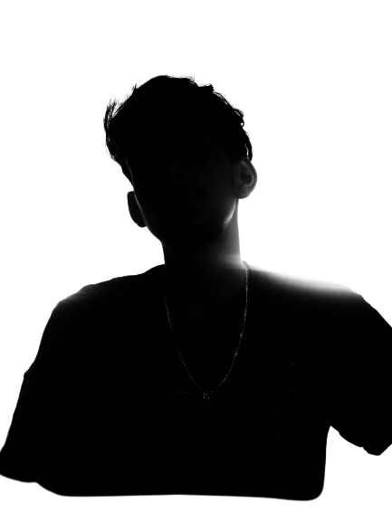

 
 

  

<h1 align="center">
    
</h1>

<h3 align="center">FullTime Software Engineer ,<a href="https://aarambhait.com" target="_blank">Aarambhait</a></h3>

 

  I’m currently working on  a <strong>Python Projects</strong>
 
I'm  constantly exploring new technologies and concepts,        
and I enjoy building and improving my skills through  personal and collaborative projects

 
 

 

  

  

  

 

 
<h2 align="center"> Languages-Frameworks-Tools </h2>
 

     
    

 

