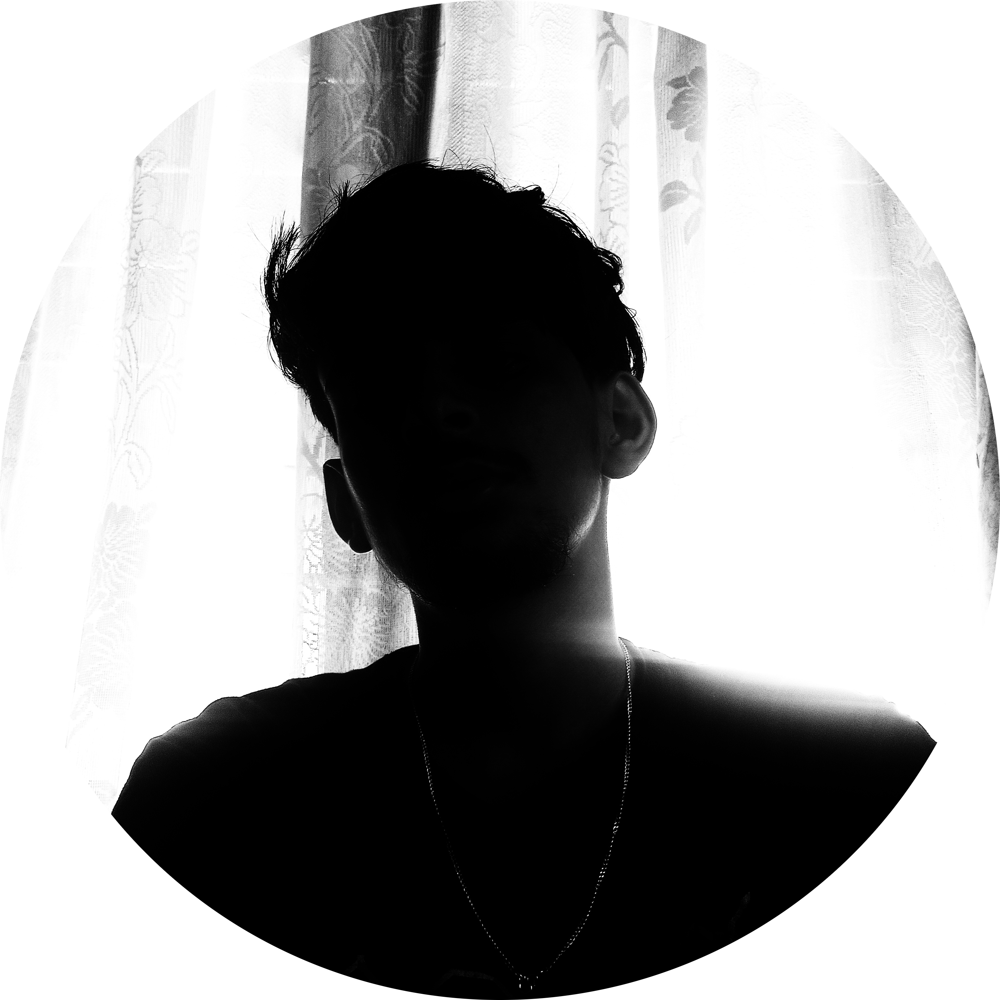

 
 

  

<h1 align="center">
    
</h1>

<h3 align="center">A passionate software developer  from Nepal</h3>

 

 🔭 I’m currently working on  a <strong>Python Projects</strong>
 
I'm  constantly exploring new technologies and concepts,        
and I enjoy building and improving my skills through  personal and collaborative projects

 
 

 

 
  
      
  
  

 

 
<h2 align="center">⚒️ Languages-Frameworks-Tools ⚒️</h2>
 

     
    

 

